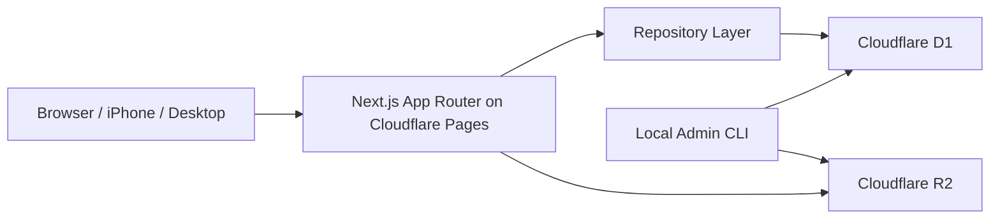

# Architecture

This project ended up with a simple but real distributed architecture:

- the browser handles interaction and playback
- the edge runtime handles uploads, reads, filtering, and progress updates
- R2 stores audio binaries
- D1 stores metadata and operational state
- a repository layer keeps data access logic in one place
- a local admin script handles destructive deletion outside the public app

## Final System Shape

## Frontend

The frontend is a server-rendered Next.js App Router application with a small amount of client-side interaction where it actually matters:

- the homepage lists items and applies server-side filters
- the upload page submits multipart form data
- the detail page renders metadata on the server and uses a client-side player for playback state

The UI is intentionally lightweight. There is no global state layer, no client-side data cache, and no heavy component system.

## Edge Runtime Layer

The edge runtime is responsible for:

- parsing uploads
- validating uploads
- applying upload protection
- uploading binaries to R2
- writing metadata to D1
- reading filtered lists and detail records from D1
- updating playback progress in D1

This is the execution environment that forced the architecture to mature. Filesystem-based patterns and Prisma-dependent production paths were not compatible with Cloudflare Pages edge execution.

## Repository Layer

`lib/audio-repository.ts` is the application data boundary.

Its responsibilities are:

- read audio items
- read a single item by id
- create new metadata rows
- update playback progress
- derive filter options
- delete metadata rows when used by admin workflows

The repository is intentionally small. It does not try to become a generic ORM abstraction. Its job is to centralize data access decisions while keeping query logic readable.

## Metadata Store: D1

D1 stores:

- audio item metadata
- playback progress
- filterable fields such as `topics`, `course`, and title keywords
- lightweight operational data such as upload-attempt records

D1 is used because the application needs structured querying, filtering, and updates, but not a large relational domain model.

## Binary Store: R2

R2 stores the uploaded audio files themselves.

This separation is a core architectural decision:

- binaries do not belong in D1
- metadata does not belong in object storage

The application stores a public file URL in metadata so playback remains simple from desktop and mobile clients.

## Admin Script

Deletion is intentionally not part of the public website.

Instead, a local admin script:

- reads the item from D1
- derives the storage key from the stored file URL
- deletes the object from R2
- deletes the metadata from D1

This keeps destructive operations out of the public runtime and matches the single-user nature of the system.

## Why Storage And Metadata Are Separate

The separation between R2 and D1 is not accidental. It solves three concrete problems:

1. Audio files need object storage semantics, not relational storage semantics.
2. Metadata must be queryable by item id, topics, course, text search, and progress state.
3. Mobile playback needs a normal HTTP URL, not a filesystem path or application-specific binary access layer.

This split is what made the project viable on Cloudflare Pages.
